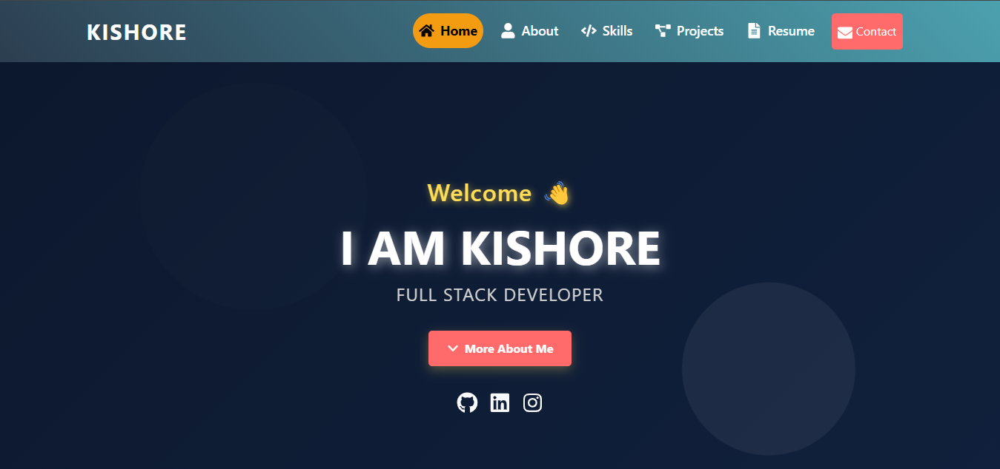
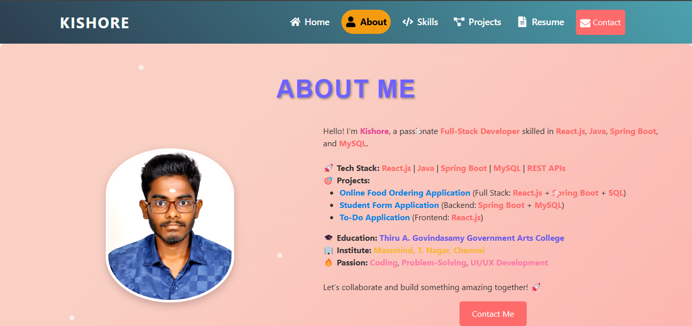
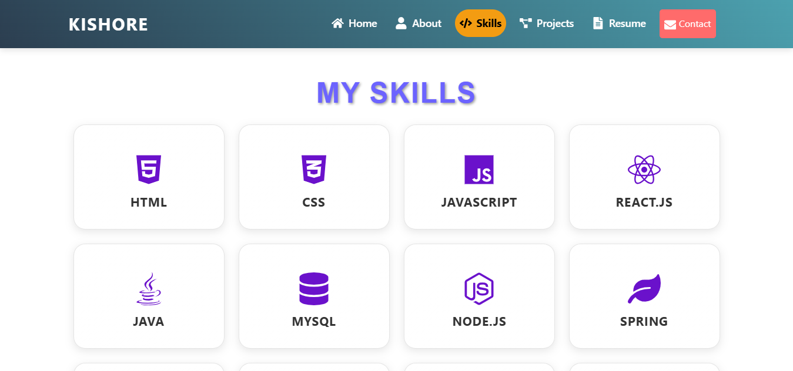
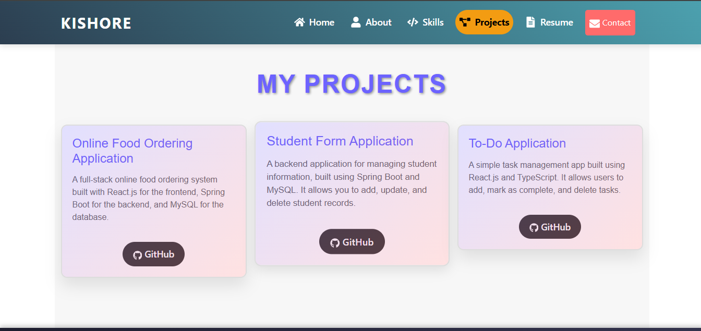
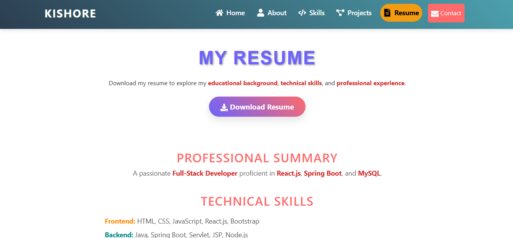

# 📌 Kishore's Portfolio

Welcome to my portfolio! I'm a passionate Full-Stack Developer specializing in **React.js**, **Spring Boot**, and **MySQL**. I enjoy building scalable web applications with a strong focus on functionality and user experience.

## 🚀 About Me
- 🎓 **Education**: B.Com (General) from Thiru A. Govindasamy Government Arts College
- 💼 **Expertise**: Full-Stack Development | REST APIs | Web Applications
- 🌟 **GitHub**: [Kishore1245](https://github.com/Kishore1245)
- 📫 **Contact**: shreekishorekishore.s@gmail.com
- 🔗 **LinkedIn**: [Kishore Sriedhar](https://www.linkedin.com/in/kishore-sriedhar-1211k2003/)
- 🌍 **Live Portfolio**: [**My Portfolio**: [Visit Here](https://kishore-portfolio1.netlify.app)](https://kishore-portfolio1.netlify.app)

## 🛠️ Tech Stack
- **Frontend**: React.js, TypeScript, HTML, CSS, Tailwind CSS
- **Backend**: Spring Boot, Java, REST APIs
- **Database**: MySQL
- **Tools**: VS Code, STS 4, Postman, Git, GitHub

## 📌 Projects Overview
### 🍛 Food Order System
A feature-rich online food ordering application:
- User authentication & role-based access
- Menu management & cart functionality
- Secure payment integration (Stripe API)

### ✅ To-Do Application
A simple yet powerful to-do list application:
- Add, update, and delete tasks
- Built with React.js and TypeScript

### 🏫 Student Form System
A web-based student database management system:
- Add, update, delete, and view student details
- Backend built with Spring Boot
- MySQL for data storage

## 🖼️ Screenshots
Here are some previews of my projects:
1. **Home Page**  
   
2. **About Me**  
   
3. **Skills**  
   
4. **Projects**  
   
5. **Resume**  
   

> **Note**: Please upload your screenshots to a `screenshots/` folder in your repository to display them correctly.

## 📈 GitHub Stats

## 📞 Get in Touch
- **LinkedIn**: [Kishore Sriedhar](https://www.linkedin.com/in/kishore-sriedhar-1211k2003/)
- **Email**: shreekishorekishore.s@gmail.com
- **GitHub**: [Kishore1245](https://github.com/Kishore1245)

---
✨ Thank you for visiting my portfolio! Feel free to explore my projects and reach out. Let's build something amazing together!

